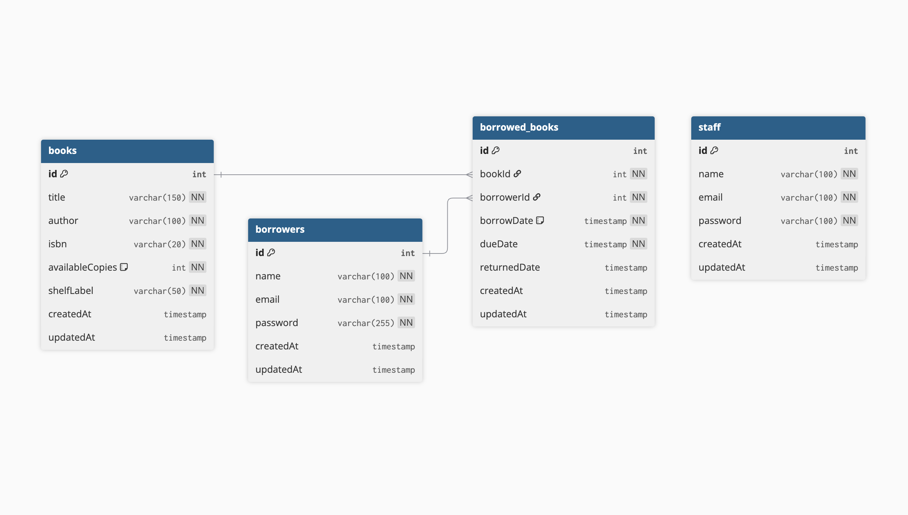

# shelfWise

Simple Library Management System

## Table of Contents

- [shelfWise](#shelfwise)
  - [Table of Contents](#table-of-contents)
  - [Database Seeding](#database-seeding)
  - [Features](#features)
  - [Requirements](#requirements)
  - [Setup](#setup)
  - [Environment Variables](#environment-variables)
  - [Running the App](#running-the-app)
    - [Development](#development)
    - [Production](#production)
  - [Docker Usage](#docker-usage)
    - [1. Start PostgreSQL only (for local development)](#1-start-postgresql-only-for-local-development)
    - [2. Run the app and database in Docker](#2-run-the-app-and-database-in-docker)
      - [Notes:](#notes)
  - [API Endpoints](#api-endpoints)
    - [Auth](#auth)
    - [Books](#books)
    - [Borrowers](#borrowers)
    - [Borrowing](#borrowing)
      - [Notes](#notes-1)
    - [Staff](#staff)
  - [Database Schema](#database-schema)
  - [Project Structure](#project-structure)

---

## Database Seeding

See [src/seeds/README.md](src/seeds/README.md) for details on the seed script and seeded data.

## Features

- User authentication (JWT-based) for staff and borrowers
- Role-based access control (staff, borrower)
- Book management (CRUD, search, rate-limited search endpoint)
- Borrowing management (borrow, return, overdue tracking)
- Borrower and staff management
- RESTful API with versioning
- PostgreSQL database integration (via Sequelize ORM)
- Docker and Docker Compose support
- Centralized error handling and logging

---

## Requirements

- Node.js v20+
- npm v9+
- PostgreSQL 13+
- Docker & Docker Compose (optional, for containerized setup)

---

## Setup

1. **Clone the repository:**
   ```sh
   git clone https://github.com/0oM4R/shelfWise.git
   cd shelfWise
   ```
2. **Install dependencies:**
   ```sh
   npm install
   ```
3. **Configure environment variables:**
   - Copy `.env.example` to `.env` and fill in your values:
     ```sh
     cp .env.example .env
     # Edit .env as needed
     ```
4. **Set up the database:**
   - Ensure PostgreSQL is running and the database/user exist as per your `.env`.
   - Run migrations and seeders if available.

---

## Environment Variables

See `.env.example` for all required variables:

```env
APP_PORT=3000
DB_HOST=localhost
DB_PORT=5432
DB_USER=your_db_user
DB_PASSWORD=your_db_password
DB_NAME=your_db_name
```

---

## Running the App

### Development

```sh
npm run dev-watch
```

The server will start on the port specified in `.env` (default: 3000).

### Production

```sh
npm run build
npm start
```

---

## Docker Usage

### 1. Start PostgreSQL only (for local development)

To use Docker only for the database and run the Node.js app locally:

```sh
docker-compose up -d postgres
```

This starts a PostgreSQL container using environment variables from your `.env` file. Set `DB_HOST=localhost` in your `.env` for local app development.

### 2. Run the app and database in Docker

To run both the Node.js app and PostgreSQL in containers:

1. Ensure your `.env` file is present in the project root. Docker Compose will use these variables for both containers.
2. Start both services:
   ```sh
   docker-compose up --build -d
   ```
   This builds the app image, starts the database, and runs the app. The app will be available at `http://localhost:3000` (or the port you set in `.env`).

#### Notes:

- The app container uses `DB_HOST=postgres` to connect to the database container (as defined in `docker-compose.yml`).
- If you change ports or credentials, update both `.env` and `docker-compose.yml` accordingly.
- To stop and remove containers:
  ```sh
  docker-compose down
  ```
- To view logs for troubleshooting:
  ```sh
  docker-compose logs -f
  ```

---

---

## API Endpoints

All endpoints are prefixed with `/api/v1`.

### Auth

- `POST /api/v1/auth/staff/register` — Register staff
- `POST /api/v1/auth/staff/login` — Staff login (returns JWT)
- `POST /api/v1/auth/borrower/register` — Register borrower
- `POST /api/v1/auth/borrower/login` — Borrower login (returns JWT)

### Books

- `GET /api/v1/books/search` — Search books by title, author, or ISBN
- `GET /api/v1/books/:id/borrowings` — Get all borrowings for a book
- `GET /api/v1/books/:id` — Get a book by ID
- `GET /api/v1/books` — List all books
- `POST /api/v1/books` — Add a new book (staff only)
- `PUT /api/v1/books/:id` — Update a book (staff only)
- `DELETE /api/v1/books/:id` — Delete a book (staff only)

### Borrowers

- `GET /api/v1/borrowers/borrowings` — Get all borrowings for the authenticated borrower
- `GET /api/v1/borrowers/:id` — Get a borrower by ID (staff only)
- `PUT /api/v1/borrowers/:id` — Update a borrower (staff only)
- `GET /api/v1/borrowers` — List all borrowers (staff only)
- `DELETE /api/v1/borrowers/:id` — Delete a borrower (staff only)

### Borrowing

- `POST /api/v1/borrowings` — Create a borrowing record (borrower or staff)
- `GET /api/v1/borrowings` — List all borrowings (staff only)
- `POST /api/v1/borrowings/return` — Mark a book as returned (borrower or staff)
- `GET /api/v1/borrowings/overdue` — List all overdue borrowings (staff only)
- `GET /api/v1/borrowings/:id` — Get a borrowing record by ID (staff only)
- `GET /api/v1/borrowings/export` — Export last month's borrowing records as CSV (staff only)
- `GET /api/v1/borrowings/export/overdue` — Export last month's overdue borrowings as CSV (staff only)

#### Notes

- All endpoints require authentication.
- Staff-only endpoints require a valid staff JWT.
- CSV export endpoints return a downloadable CSV file of borrowing data for the previous month.

### Staff

- `GET /api/v1/staff` — List all staff (staff only)
- `GET /api/v1/staff/:id` — Get a staff member by ID (staff only)
- `PUT /api/v1/staff/:id` — Update a staff member (staff only)
- `DELETE /api/v1/staff/:id` — Delete a staff member (staff only)

---

---

## Database Schema

The database schema consists of the following main tables:

- **Book**: Stores information about books (title, author, ISBN, available copies, shelf label).
- **Borrower**: Stores library users who can borrow books (name, email, password).
- **Staff**: Stores staff members who manage the library (name, email, password).
- **BorrowedBook**: Join table linking books and borrowers, tracking borrow/return dates and due dates.

**Relationships:**

- A `Book` can have many `BorrowedBook` records (one-to-many).
- A `Borrower` can have many `BorrowedBook` records (one-to-many).
- Each `BorrowedBook` belongs to one `Book` and one `Borrower`.

See the diagram below for a visual overview:



---

## Project Structure

```
src/
  ├── app.ts           # Main Express app setup
  ├── server.ts        # Application entry point
  ├── config/          # Environment & app configuration
  ├── controllers/     # Request/response controllers
  ├── database/        # Database connection & setup
  ├── middleware/      # Custom Express middlewares
  ├── models/          # Sequelize models (ORM definitions)
  ├── routes/          # API route definitions (versioned)
  │     └── v1/        # Version 1 API routes
  ├── seeds/           # Database seed scripts & data
  ├── services/        # Business/domain logic (service layer)
  ├── types/           # Shared TypeScript type definitions
  └── utils/           # Utility/helper functions
```

---
